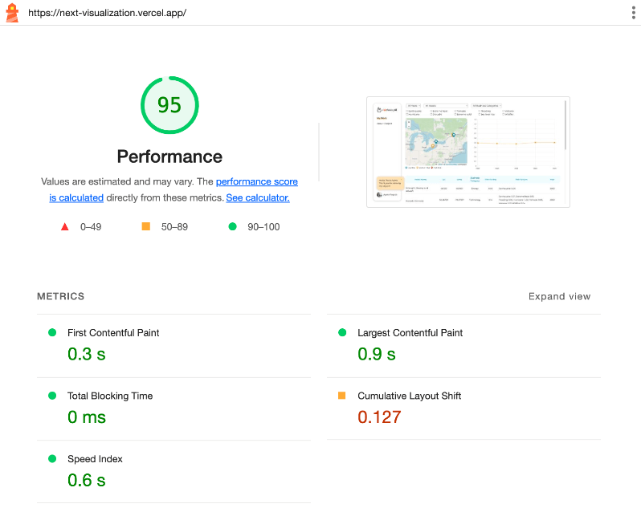

# Risk Viz

An interactive dashboard for exploring climate-risk data across 5,000 assets — a map, a time-series line chart, and a sortable, paginated table, all driven by a shared filter state.

**Live:** https://next-visualization.vercel.app/



## Quick start

```bash
npm install
npm run dev          # http://localhost:3000
npm test             # jest --watch
npm run test:e2e     # playwright
npm run build        # production build
```

Node 18+ recommended. No env vars required — the dataset is bundled.

## Features

- **Map** (Leaflet) with risk-coded markers; clicking a marker filters the rest of the dashboard to that location.
- **Line chart** (Chart.js) showing average risk rating per year, with per-risk-factor breakdown in the tooltip.
- **Table** with server-paginated rows (10/page) and per-column sorting.
- **Shared filter bar**: year, asset, business category, individual risk factors. All three views react to the same filters.
- Keyboard navigable, with a focus on accessible markup and semantics.

## Architecture

```
app/
├── api/risks/        # Route handlers — one endpoint per view, returns view-specific shape
│   ├── map/          #   { "lat,long": { markers, riskRating, ... } }   ← keyed for O(1) lookup
│   ├── line/         #   pre-aggregated by year
│   ├── table/        #   paginated, sorted server-side
│   └── filters/      #   distinct years / assets / categories
├── components/
│   ├── charts/       # Map, Line, Table — presentational
│   └── chartSections/# Section wrappers — own data-fetching (React Query) per view
├── hooks/            # useFilters — filter state read/written as URL search params (nuqs)
├── lib/              # riskParams — shared query keys, search-param builders, fetchJson
├── providers.tsx     # React Query client + nuqs adapter
└── page.tsx          # Server component; pre-fetches initial payload for first paint
```

### Key decisions

**One endpoint per view, not one generic `/risks` endpoint.**
Each view needs a different shape (keyed object for the map, year-aggregated for the line, paginated rows for the table). Splitting them keeps payloads small and lets each endpoint do its own aggregation server-side instead of shipping 5k rows to the client and reshaping three times.

**Initial payload rendered on the server.**
`page.tsx` is an async server component that calls the same aggregation functions the route handlers use, so first paint has no client-side fetch waterfall. Each section hydrates that payload into React Query (`initialData`); subsequent filter changes refetch through the API.

**Map markers are also a filter.**
Clicking a marker pushes a `lat,long` into the `location` search param, which the table and line chart both read. This was the cleanest way to make the map feel "live" without a separate "selected location" concept duplicated across components.

**URL search params for filter state, not Redux/Zustand/Context.**
Filter state lives entirely in the URL via nuqs (`useFilters`), so views are shareable by link and survive back/forward navigation without any extra store. The state surface is small (~5 fields) and only the filter bar writes to it, so a client store would add ceremony without buying anything the URL doesn't already give for free.

**React Query for the data layer.**
Each section owns its fetch keyed by the current filters, with `keepPreviousData` so the table doesn't flash empty during pagination and a shared `staleTime` to dedupe refetches across views.

**Aggregation in API routes today; backend tomorrow.**
The dataset is loaded into server memory and reshaped per request. This is fine at 5k rows; at production scale the aggregation should move to a dedicated backend/database so the Next API can stay a thin pass-through, but that's outside the scope of this front-end sample.

**Risk bucketing**: low (< 0.5), medium (0.5–0.7), high (> 0.7). Brand-aligned colors.

### Performance

- Map is lazy-loaded with `next/dynamic` (Leaflet is ~140 kB and SSR-incompatible).
- Table is paginated server-side — the client only ever holds 10 rows.
- Aggregations are keyed objects (lat,long → marker bucket) so lookups are O(1).
- Server component pre-fetch eliminates the initial fetch waterfall.

### Testing

**Unit / integration** — Jest + React Testing Library. Coverage is intentionally focused on filter logic and the table — the parts most likely to regress when adding features. Charts are integration-tested through their section wrappers rather than unit-tested against Chart.js internals.

**E2E** — Playwright (`e2e/`) covers the flows that span all three views: filtering, table pagination/sorting, and navigation to the About page. These are exactly the cross-cutting interactions unit tests miss.

```bash
npm run coverage    # jest with coverage
npm run test:e2e    # playwright
```

## What I'd do next

A take-home is a snapshot. Were this a real product, the next iterations would be:

1. **Optimize the map's performance** — Leaflet (~140 kB, SSR-incompatible) is the heaviest part of the page. It's already lazy-loaded, but at higher marker counts I'd look at clustering markers and only rendering those in the current viewport to keep interaction smooth.
2. **Move aggregation to a real backend** — the current in-memory approach doesn't scale past a few tens of thousands of rows. The biggest architectural step is pushing the aggregation out of the Next API and into a dedicated data layer, with the front end consuming it through the same API contract.

## Stack

Next.js 14 (App Router) · React 18 · TypeScript 5.7 · Tailwind 3 · shadcn/ui + Radix · React Query · nuqs · React Leaflet · Chart.js · Jest · React Testing Library · Playwright
